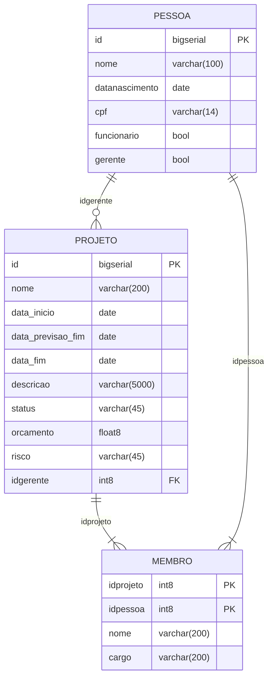

# projectmanagement

### Requisitos

1. JDK 11
1. Maven 3

Durante a prova prática foi incluido o Swegger2 que pode ser acessando via url: http://localhost:8080/swagger-ui/

* Correção realizada no script abaixo pois o antigo apresentava erro na definição da chave composta Também foi incluido mais dois campos (nome, cargo) como indicado.

```sql
-- -----------------------------------------------------
-- Table Membros CORRIGIDA
-- -----------------------------------------------------

CREATE TABLE public.membros (
    idprojeto int8 NOT NULL,
    idpessoa int8 NOT NULL,
    nome varchar(200) NOT NULL,
    cargo varchar(200) NOT NULL,
    CONSTRAINT pk_membros PRIMARY KEY (idprojeto, idpessoa),
    CONSTRAINT fk_membros_pessoa FOREIGN KEY (idpessoa) REFERENCES public.pessoa(id),
    CONSTRAINT fk_membros_projeto FOREIGN KEY (idprojeto) REFERENCES public.projeto(id)
);

-- -----------------------------------------------------
-- Table Membros ANTIGA COM ERRO NA DEFINIÇÃO DA CHAVE
-- -----------------------------------------------------
CREATE TABLE membros (
    idprojeto bigint NOT NULL, 
    idpessoa bigint NOT NULL,  
    CONSTRAINT pk_membros_projeto PRIMARY KEY (idprojeto),
    CONSTRAINT fk_membros_pessoa FOREIGN KEY (idpessoa)
    REFERENCES projeto (id) MATCH SIMPLE ON UPDATE NO ACTION ON DELETE NO ACTION,
    CONSTRAINT fk_pessoa FOREIGN KEY (idpessoa)
    REFERENCES pessoa (id) MATCH SIMPLE ON UPDATE NO ACTION ON DELETE NO ACTION
);
```


## Diagrama completo



## SQL das tabelas completo e corrigido

``` sql

-- DROP TABLE pessoa;
CREATE TABLE pessoa (
	id bigserial NOT NULL,
	nome varchar(100) NOT NULL,
	datanascimento date NULL,
	cpf varchar(14) NULL,
	funcionario bool NULL,
	gerente bool NULL,
	CONSTRAINT pk_pessoa PRIMARY KEY (id)
);

-- DROP TABLE projeto;
CREATE TABLE projeto (
	id bigserial NOT NULL,
	nome varchar(200) NOT NULL,
	data_inicio date NULL,
	data_previsao_fim date NULL,
	data_fim date NULL,
	descricao varchar(5000) NULL,
	status varchar(45) NULL,
	orcamento float8 NULL,
	risco varchar(45) NULL,
	idgerente int8 NOT NULL,
	CONSTRAINT pk_projeto PRIMARY KEY (id),
	CONSTRAINT fk_gerente FOREIGN KEY (idgerente) REFERENCES pessoa(id)
);

-- DROP TABLE membros;
CREATE TABLE membros (
	idprojeto int8 NOT NULL,
	idpessoa int8 NOT NULL,
	nome varchar(200) NOT NULL,
	cargo varchar(200) NOT NULL,
	CONSTRAINT pk_membros PRIMARY KEY (idprojeto, idpessoa),
	CONSTRAINT fk_membros_pessoa FOREIGN KEY (idpessoa) REFERENCES pessoa(id),
	CONSTRAINT fk_membros_projeto FOREIGN KEY (idprojeto) REFERENCES projeto(id)
);

```

